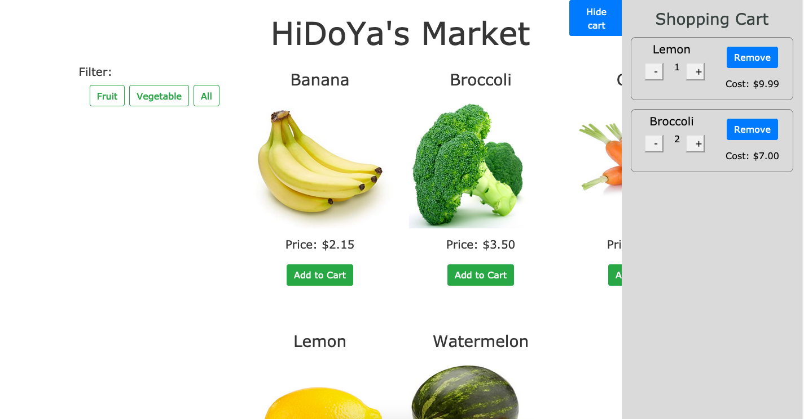

This project was bootstrapped with [Create React App](https://github.com/facebook/create-react-app).

# Shopping App
Prototype shopping application made with React for the frontend and Express with Node for RESTful API backend which features CRUD operations for the shopping items. Uploading files to the backend implemented with multer. Other tools used include bootstrap and react-bootstrap for prototyping, SASS for CSS preprocessing, and MySQL for data storage.
   
